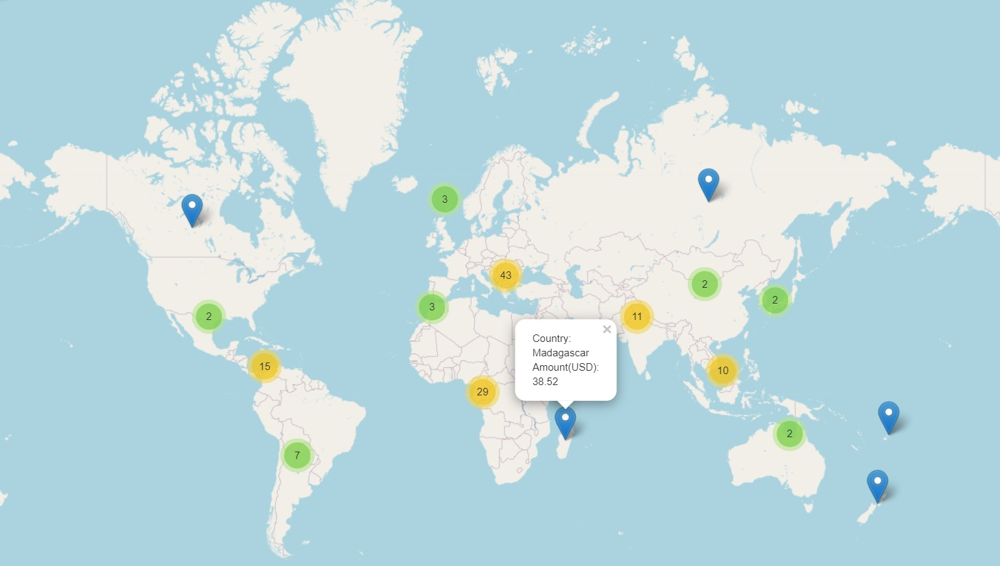
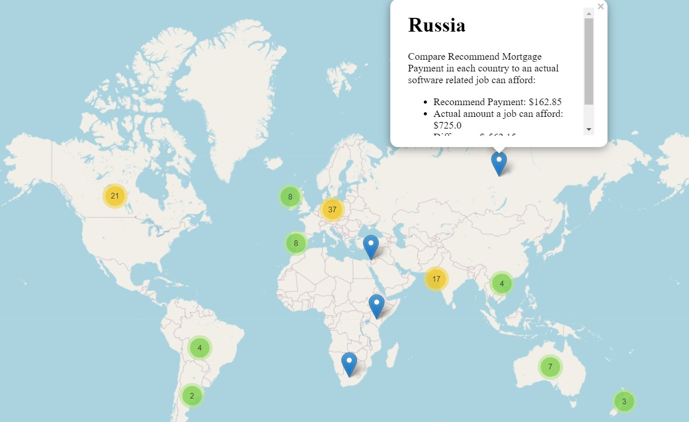
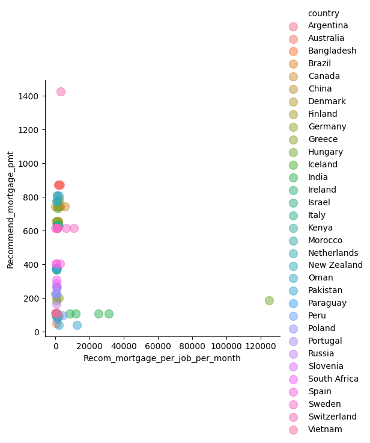

# Independent Global Cost of Living 

#### By Chloe Le, Reed Carter Phil Kendall

#### Visualizations of the cost of living around the globe 

## Technologies Used

* github
* python
* pandas
* jupyterlab
* matplotlib
* geopandas
* pycountry
* mapclassify
* folium
* seaborn

## Description

This repo is a copy of the Global Cost of Living that I collaborated with my team. The original copy can be found here: https://github.com/Reed-Carter/Global-Cost-of-Living.git

In the original repo, my portion of the project was calculating the recommended mortgage payment in each country and created a world map for visualization. Here is the result:

On top of that, I also wanted to compare the recommended mortgage payments for different tech jobs in each country. To do that, I found a second dataset called tech_salaries.csv and merge it to the original one cost-of-livings.csv. After merged, I sorted the new dataset to show highest and lowest mortgage payments for each job in each countries. 

For this repo, I added some more graphs for better visualization.

* This is an interactive map shows each country and its mortgage amount
  

* Here is another interactive map shows each country, its national mortgage amount, mortgage amount per job title, and the company name in HTML format

 * Lastly is the scatter plot show recommended mortgage worldwide

 

## Setup/Installation Requirements

* Clone this repository to your desktop
* Navigate to the top level directory
* Run 'pip install -r requirements.txt' to install all the requirements so that main.py or other notebooks can run correctly
* Open main.py

## Known Bugs

* no known bugs

## License

MIT License

Copyright (c) [2022] [Chloe Le, Reed Carter, Phil Kendall]

Permission is hereby granted, free of charge, to any person obtaining a copy
of this software and associated documentation files (the "Software"), to deal
in the Software without restriction, including without limitation the rights
to use, copy, modify, merge, publish, distribute, sublicense, and/or sell
copies of the Software, and to permit persons to whom the Software is
furnished to do so, subject to the following conditions:

The above copyright notice and this permission notice shall be included in all
copies or substantial portions of the Software.

THE SOFTWARE IS PROVIDED "AS IS", WITHOUT WARRANTY OF ANY KIND, EXPRESS OR
IMPLIED, INCLUDING BUT NOT LIMITED TO THE WARRANTIES OF MERCHANTABILITY,
FITNESS FOR A PARTICULAR PURPOSE AND NONINFRINGEMENT. IN NO EVENT SHALL THE
AUTHORS OR COPYRIGHT HOLDERS BE LIABLE FOR ANY CLAIM, DAMAGES OR OTHER
LIABILITY, WHETHER IN AN ACTION OF CONTRACT, TORT OR OTHERWISE, ARISING FROM,
OUT OF OR IN CONNECTION WITH THE SOFTWARE OR THE USE OR OTHER DEALINGS IN THE
SOFTWARE.